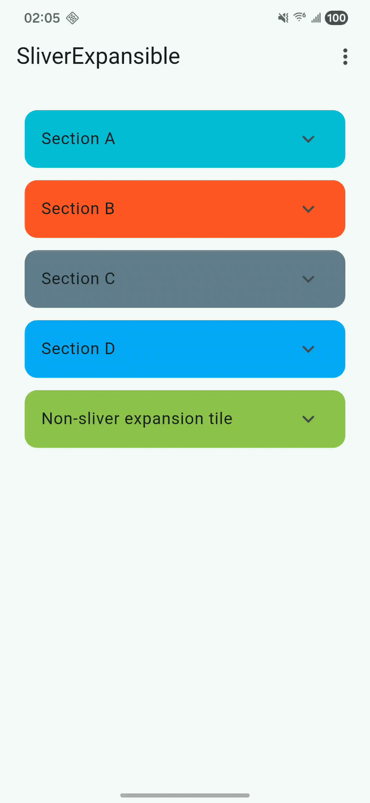

# sliver_expansion

Sliver expansion primitives for Flutter:

- `SliverExpansible`: low-level sliver that expands/collapses a body sliver with
  an animation, driven by a `SliverExpansibleController`.
- `SliverExpansionTile`: a Material-style sliver expansion tile (similar to
  `ExpansionTile`) with optional pinned header and lazy children building.

## Demo

<p align="center">
  
</p>

## Getting started

Add the dependency to your `pubspec.yaml`:

```yaml
dependencies:
  sliver_expansion: ^0.0.1
```

Import:

```dart
import 'package:sliver_expansion/sliver_expansion.dart';
```

## Usage

### SliverExpansible

`SliverExpansible` is a primitive that lets you provide:

- a header sliver (always visible)
- a body sliver (expandable/collapsible)
- a controller (toggle programmatically or from user gestures)

```dart
CustomScrollView(
  slivers: [
    SliverExpansible(
      key: const PageStorageKey<String>('my-section'),
      controller: controller, // SliverExpansibleController in your State
      headerBuilder: (context, animation) {
        return SliverToBoxAdapter(
          child: ListTile(
            title: const Text('Tap to expand'),
            trailing: RotationTransition(
              turns: animation.drive(Tween(begin: 0.0, end: 0.5)),
              child: const Icon(Icons.expand_more),
            ),
            onTap: controller.toggle,
          ),
        );
      },
      bodyBuilder: (context, animation) {
        return SliverList.builder(
          itemCount: 5,
          itemBuilder: (context, index) => ListTile(title: Text('Item #$index')),
        );
      },
    ),
  ],
)
```

Tip: when used inside a scrolling view, give it a unique `PageStorageKey` to
allow the expanded state to be restored as it scrolls in/out of view.
If you pass a `SliverExpansibleController`, keep it in your `State` and
`dispose()` it.

### SliverExpansionTile

`SliverExpansionTile` is a higher-level widget with a `ListTile`-style header.
(If you were looking for `SliverExpansibleTile`, this package exports
`SliverExpansionTile`.)

```dart
CustomScrollView(
  slivers: [
    SliverExpansionTile(
      title: const Text('Group'),
      pinned: true,
      children: List.generate(
        5,
        (i) => ListTile(dense: true, title: Text('Item #$i')),
      ),
    ),
  ],
)
```

For long lists, use the lazy constructor:

```dart
SliverExpansionTile.builder(
  title: const Text('Lazy group'),
  itemCount: 100,
  itemBuilder: (context, index) => ListTile(title: Text('Row #$index')),
)
```

## Example

See the runnable app in `example/` for a more complete demo.

## Notes

- `SliverExpansionTile` follows `ExpansionTileThemeData` (Material theming).
- Technical limitation: to support lazy building with
  `SliverExpansionTile.builder()`, the expand/collapse animation can’t exactly
  match `ExpansionTile` (current limitation of sliver rendering).
- If you pass a `SliverExpansibleController`, remember to `dispose()` it.
